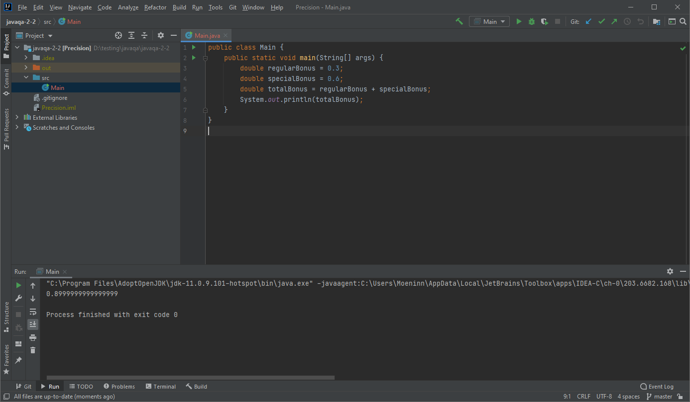

# Отчёт о тестировании Precision

## Краткое описание

15.12.2020 - 16.12.2020 было проведено исследовательское тестирование кода приложения  Precision

На тестирование затрачено: 2ч

В результате тестирования выявлены следующие дефекты:
* [Некорректная сумма бонусов](https://github.com/Bogdmoen/javaqa-2-1/issues/1)

## Описание процесса тестирования

- В качестве тестовых данных использовались различные комбинации чисел, которые присваивались переменным "regularBonus" и "specialBonus"
0.3 и 0.2
0.1 и 0.1
0.5 и 0.1 и т.д.

1. Код приложения Precision запускается и польностью совместимо с java 11.

2. Проверка функционала выполнялась путем присвоения различных числовых значений  переменным "regularBonus" и "specialBonus"  и выполения кода в среде IntelliJ IDEA

3. В ходе тестирования выявлены проблемы с подсчетом суммы бонусов при значениях "0.3" и "0.6"

Тестирование производилось в следующем окружении:
* Win 10 x64
* Java 11.0.9.1
